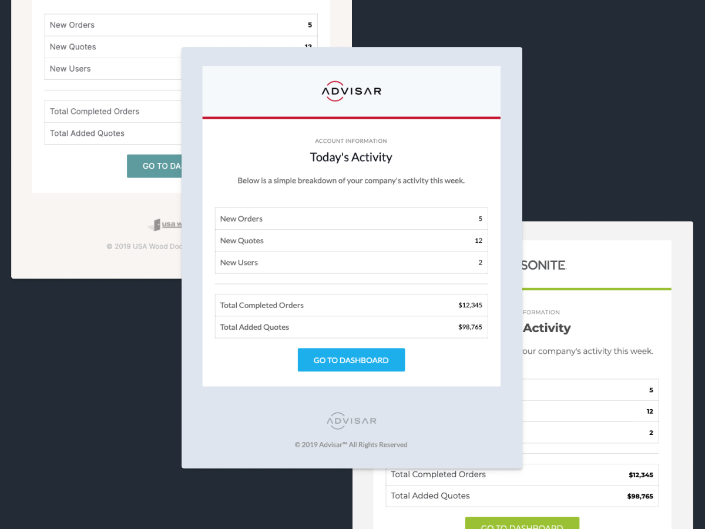

# Application Emails with MJML


## What is this project?
This repository a collection of branded MJML email templates that are used across multiple applications. Many of our companies share the same messaging, so why not the same template (__albeit with a few simple style changes__)? This build let's us create common and company-specific templates without the painstaking one-off changes.

#### Features
- **Simple:** We're using MJML to build emails, so things are modular and semantic
- **Usable:** Tested across dozens of devices, browsers, and email clients to ensure consistency and usability.
- **Modular:** Pick from a library of components to add into any system
- **Custom:** Add a new company without creating brand new templates manually.

The architecture of this project helps compile templates for multiple brands that may utilize the same body template.

### Adding a new company

To add a new company, create a new directory in the `src/includes` folder and add the folder name to the `companies` array in the `gulpfile.js`. Be sure to include all of the same partials that are used in the other company folders:

```
header.mjml
logo-section.mjml
footer.mjml
```

## What is MJML?
MJML is a markup language designed to reduce the pain of coding a responsive email. Its semantic syntax makes it easy and straightforward and its rich standard components library speeds up your development time and lightens your email codebase. MJML’s open-source engine generates high quality responsive HTML compliant with best practices.

MJML rolls up all of what Mailjet has learned about HTML email design over the past few years and abstracts the whole layer of complexity related to responsive email design.

Get your speed and productivity boosted with MJML’s semantic syntax. Say goodbye to endless HTML table nesting or email client specific CSS. Building a responsive email is super easy with tags such as <mj-section> and <mj-column>.

MJML has been designed with responsiveness in mind. The abstraction it offers guarantee you to always be up-to-date with the industry practices and responsive. Email clients update their specs and requirements regularly, but we geek about that stuff - we’ll stay on top of it so you can spend less time reading up on latest email client updates and more time designing beautiful email.

## Where can I learn how to make an email using MJML?
Start building responsive email with MJML. You’ll find in the documentation the full list of components available and their associated attributes.

[Official Documentation](https://mjml.io/documentation)

[MJML Resources](https://mjml.io/resources)


## Installation:
This projects helps compile multiple MJML templates at once using:

```
gulp
gulp-mjml
mjml
mjml-cli
gulp-imagemin
del
```
You can install the packages in the `package.json` using the following command:
```
npm install
```

## Folder Structure
```
├── src
│   ├── common
│   |   └── common-template.mjml
│   ├── specific
│   |   └── company
│   |       └── specific-template.mjml
│   ├── images
│   |   └── example-image.png
│   └── includes
│   |   └── company
│   |       └── partial.mjml
├── public
│   ├── company
│   |   ├── specfic-template.html
│   |   └── common-template.html
│   └── images
│   |   └── example-image.png
├── gulpfile.js
├── package.json
└── README.md
```

## Get Started
Use the following commands to compile all of the MJML files in the `src` folder:

```
gulp compile  # Compile MJML templates
gulp images   # Optimize images
gulp watch    # Watch all changes

gulp          # Compile and watch

gulp clean    # Clean all copied and compiled files
```

#### TODO
- verbose error warnings
